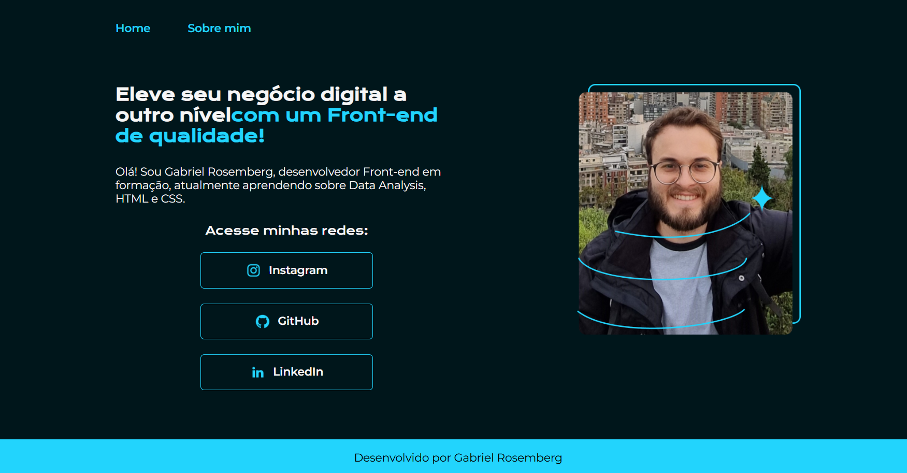

# 🌐 Portfólio Pessoal - Gabriel Rosemberg

Este é o repositório do meu portfólio pessoal, desenvolvido com HTML e CSS. O objetivo é apresentar minhas habilidades, experiências e aprendizados nas áreas de Front-end.

## ✨ Visão Geral

O projeto é composto por duas páginas principais:

- **Home (`index.html`)**: Uma introdução ao meu trabalho como desenvolvedor Front-end em formação.
- **Sobre Mim (`about.html`)**: Detalhes sobre minha trajetória profissional, o que estou estudando e áreas de interesse para colaborações.

## 🛠️ Tecnologias Utilizadas

- HTML5
- CSS3

## 📄 Estrutura de Pastas

📁 Portifolio-HTML-e-CSS/ 
    ├── 📁 assets/ # Imagens utilizadas no site 
    ├── 📁 styles/ # Arquivos CSS 
    │   ├── normalize.css 
    │   └── style.css 
    ├── index.html # Página principal 
    └── about.html # Página "Sobre mim"

## 🔗 Funcionalidades

- Design responsivo com uso de media queries.
- Navegação entre páginas.
- Links para redes sociais.
- Layout estilizado com fontes do Google Fonts.

## 📸 Captura de Tela

## 📬 Contato
Fique à vontade para entrar em contato comigo pelas redes sociais listadas na página principal.

Desenvolvido por Gabriel Rosemberg.